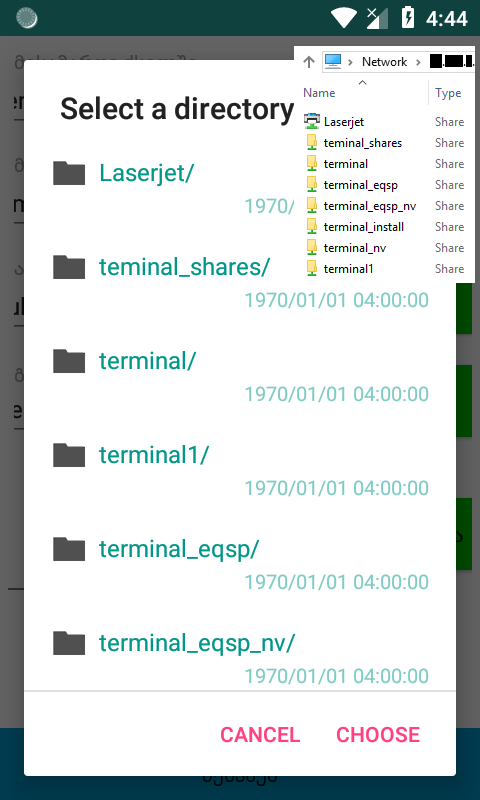
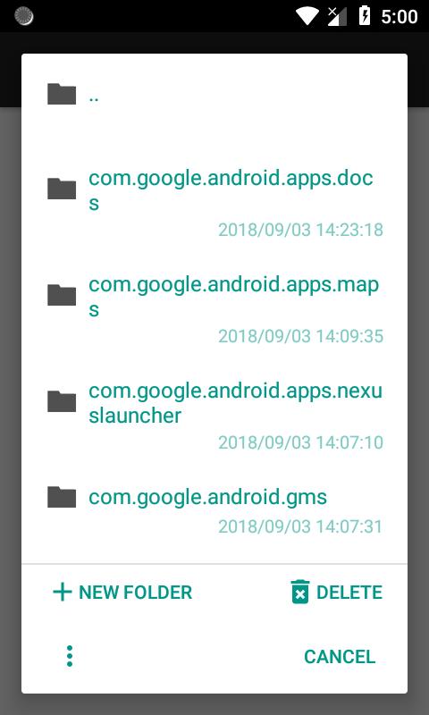
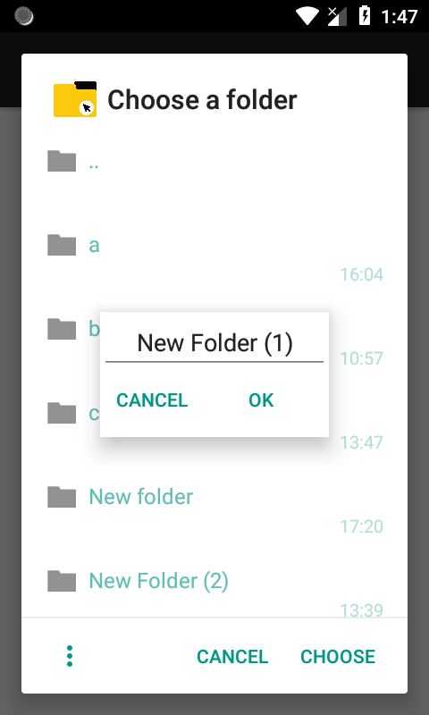

# android-file-chooser


## Overview


[](https://android-arsenal.com/details/1/6982)
[](https://bintray.com/hedzr/maven/filechooser/_latestVersion)
[](https://jitpack.io/#hedzr/android-file-chooser)

`android-file-library` is a lightweight file/folder chooser.
This (`android-smbfile-chooser`) is my take on it. I added the ability to use [jcifs.smb.SmbFile](https://jcifs.samba.org/) to browse a Windows shared directory. I also added some small functionality like the ability to add new folders on the go, or delete files, as well as some event listeners like OnBackPressed and OnDismissed (works only on API >= 17).

### Snapshots



### Demo Application

A demo-app of the original can be installed from [Play Store](https://play.google.com/store/apps/details?id=com.obsez.android.lib.filechooser.demo).

<a href='https://play.google.com/store/apps/details?id=com.obsez.android.lib.filechooser.demo&pcampaignid=MKT-Other-global-all-co-prtnr-py-PartBadge-Mar2515-1'></a>

**NOTE**:

I replaced all methods "with___()" with "set___()"! also, use static method "newDialog(context)" instead of a constuctor.
NtlmPasswordAuthentication not yet supported! (haven't had the need for it)

## Usage

```
try{
    SmbFileChooserDialog dialog = SmbFileChooserDialog.newDialog(context, "**.***.*.**")
        .setResources("select a directory", "choose", "cancel")
        .setFilter(true, false)
        .setOnChosenListener((path, file) -> {
            try{
                Toast.makeText(context,
                    file.isDirectory() ? "directory" : "file" + " selected: " + path,
                    Toast.LENGTH_SHORT)
                .show();
            } catch(SmbException e){
                e.printStackTrace();
            }
        })
        .build()
        .show();
} catch(MalformedURLException | InterruptedException | ExecutionException e){
    e.printStackTrace();
}
```

## What's New?
- by default the option to create new folder and delete files is disabled.
```
.enableOptions(true)
```
- now you can also pass Strings instead of Resourse id. **if Resourse id was set, it will take priority over Strings!**
```
.setOptionResources(0, 0, 0, 0)
.setOptionResources("new folder", "delete", "cancel", "ok")
.setOptionsIcons(R.drawable.ic_menu_24dp, R.drawable.ic_add_24dp, R.drawable.ic_delete_24dp)
```
- by default touching outside the dialog does nothing.
```
.cancelOnTouchOutside(true)
```
- by default clicking any button (except neutral/options) will close the dialog. if you disable that, override at least one so you can close the dialog **(that includes the back button)**
```
.dismissOnButtonClick(false)
.setNegativeButtonListener(new DialogInterface.OnClickListener(){
    @Override
    public void onClick(final DialogInterface dialog, final int which){
        dialog.dismiss();
    }
})
```
- I've made it so that back button takes you up a directory if there's any, otherwise it closes the dialog. if you want to change the behaviour when there's nothing to go back use setOnLastBackPressedListener. **LastBackPressed won't be called if you use setOnBackPressedListener!**
```
.setOnLastBackPressedListener(new FileChooserDialog.OnBackPressedListener(){
    @Override
    public void onBackPressed(@NonNull final AlertDialog dialog){
        // there is no parent directory
    }
})
//.setOnBackPressedListener(...)
```
- if you want to limit the naming of new folders use this. by default the max length is set to 255, and the regex is *\"\[\<\>\|\\\\\:\&\;\#\\\n\\\r\\\t\?\*\~\\\0\-\\\3\7\]\"*.
```
.setNewFolderFilter(new FileUtil.NewFolderFilter(maxLength, regex))
```

for more information please refere to the [original](https://github.com/hedzr/android-file-chooser).

## Acknowledges

many peoples report or contribute to improve me, but only a few of them be put here — it's hard to list all.

- logo and banner by: [**iqbalhood**](https://github.com/iqbalhood)
- codes and reports: [**bostrot**](https://github.com/bostrot), [**SeppPenner**](https://github.com/SeppPenner), [**lucian-cm**](https://github.com/lucian-cm), [**ghost**](https://github.com/ghost), [**UmeshBaldaniya46**](https://github.com/UmeshBaldaniya46) ...


## License

Copyright 2015-2018 Hedzr Yeh

Licensed under the Apache License, Version 2.0 (the "License");
you may not use this file except in compliance with the License.
You may obtain a copy of the License at

   http://www.apache.org/licenses/LICENSE-2.0

Unless required by applicable law or agreed to in writing, software
distributed under the License is distributed on an "AS IS" BASIS,
WITHOUT WARRANTIES OR CONDITIONS OF ANY KIND, either express or implied.
See the License for the specific language governing permissions and
limitations under the License.

