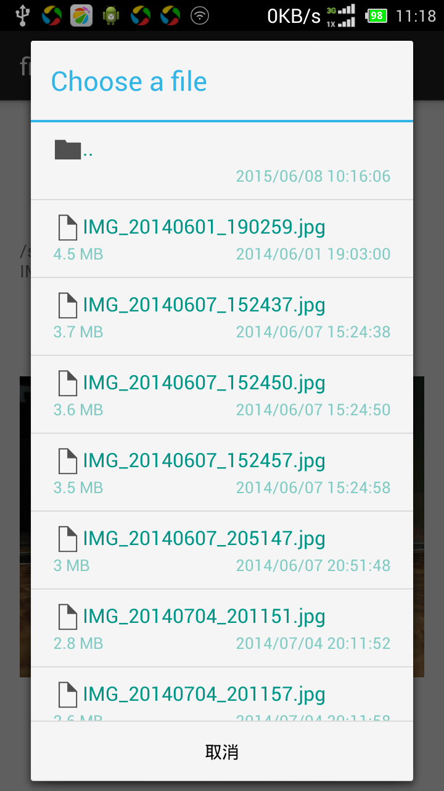
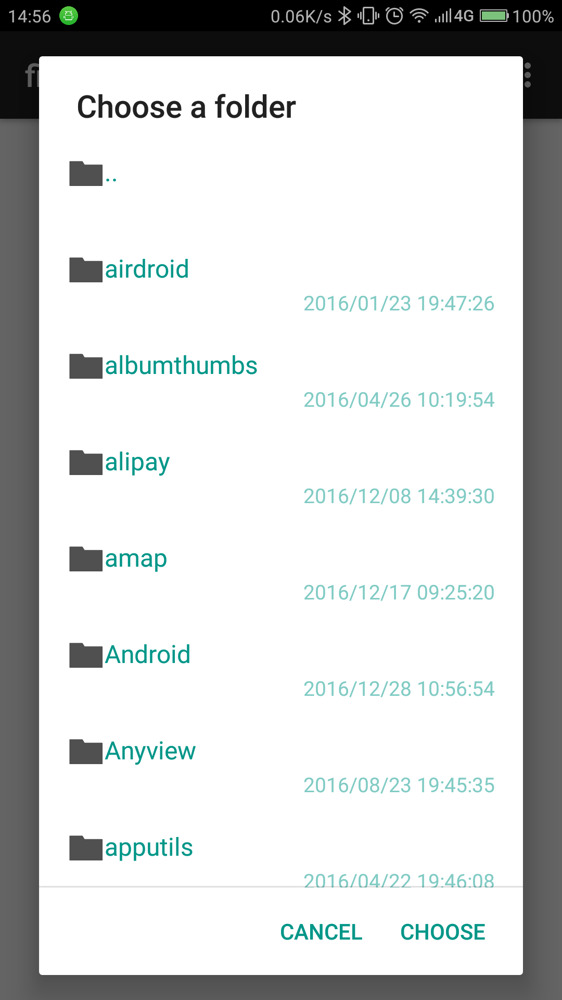

# android-file-chooser

[](https://android-arsenal.com/details/1/6982)
[](https://bintray.com/hedzr/maven/filechooser/_latestVersion)
[](https://jitpack.io/#hedzr/android-file-chooser)
[](https://travis-ci.com/hedzr/android-file-chooser)

`android-file-library` is a lightweight file/folder chooser.

## Overview


### Snapshots

<table><tr><td>

</td><td>

</td><td>

</td></tr></table>


### Demo Application

A demo-app can be installed from [Play Store](https://play.google.com/store/apps/details?id=com.obsez.android.lib.filechooser.demo).

<a href='https://play.google.com/store/apps/details?id=com.obsez.android.lib.filechooser.demo&pcampaignid=MKT-Other-global-all-co-prtnr-py-PartBadge-Mar2515-1'></a>


## Changes

### `x1.2.0` branch

- **In progress**
- Plan: uses AndroidX
- Done:
  - Keyboard supports: process SPACE and ENTER up event;
  - file list no focus when dailog first showing;
  - better storage media detect algorithm for Android M+;
  - no WRITE_EXTERNAL_STORAGE requests if not `enableOptions(true)`;
  - after requested permissions, try showing dialog again instead of return directly;

### v1.1.x patches on `master`

- #48: add `displayPath(boolean)`, thank you [@Guiorgy](https://github.com/Guiorgy).

### v1.1.x

- no WRITE_EXTERNAL_STORAGE requests if not `enableOptions(true)`;

- after requested permissions, try showing dialog again instead of return directly;

- #42: onBackPressedListener not fired.

  Now, use `withCancelListener` to handle back key. see also [below](#onCancelListener)

- #45: add `titleFollowsDir(boolean)`  to allow title following the change of current directory.

- ...

### Archived History:

- create new folder on the fly, and the optional multiple select mode for developer, thx [Guiorgy](https://github.com/Guiorgy) and his [android-smbfile-chooser](https://github.com/Guiorgy/android-smbfile-chooser)
- Up (`..`) on the primary storage root will be replaced with `.. SDCard`, it allows to jump to external storage such as a SDCard and going back available too.
- DPad supports, arrow keys supports (#30)


## Usages

### Configuration

#### build.gradle

android-file-chooser was released at jcenter, declare deps with:

```gradle
implementation 'com.obsez.android.lib.filechooser:filechooser:$android_file_chooser_version'
```

for the newest version(s), looking up the badges above.


#### taste the fresh

there is a way to taste the `master` branch with [jitpack.io](https://jitpack.io):

1. add the jitpack repository url to your root build.gradle:

```gradle
allprojects {
    repositories {
        google()
        jcenter()
        maven { url "https://jitpack.io" }
    }
}
```

2. import `android-file-chooser`

```gradle
implementation 'com.github.hedzr:android-file-chooser:master-SNAPSHOT'
// implementation 'com.github.hedzr:android-file-chooser:v1.1.14'
```

> **Tips for using JitPack.io**
>
> To disable gradle local cache in your project, add stretegy into your top `build.grable`:
>
> ```gradle
> configurations.all {
>     resolutionStrategy.cacheChangingModulesFor 0, 'seconds'
>     resolutionStrategy.cacheDynamicVersionsFor 0, 'seconds'
> }
> ```
>
> ref: https://github.com/spring-gradle-plugins/dependency-management-plugin/issues/74#issuecomment-182484694
>
> Sometimes it's right, sometimes ... no more warrants.

### Codes

> **Tips**
>
> 1. I am hands down `AlertDialog`.
> 2. Any codes about `ChooserDialog`, such as the following demo codes, should be only put into UI thread.

FileChooser android library give a simple file/folder chooser in single call (Fluent):

#### Choose a Folder

```java
    new ChooserDialog(MainActivity.this)
            .withFilter(true, false)
        	.withStartFile(startingDir)
        	// to handle the result(s)
            .withChosenListener(new ChooserDialog.Result() {
                @Override
                public void onChoosePath(String path, File pathFile) {
                    Toast.makeText(MainActivity.this, "FOLDER: " + path, Toast.LENGTH_SHORT).show();
                }
            })
            .build()
            .show();
```

#### Choose a File

```java
    new ChooserDialog(MainActivity.this)
            .withStartFile(path)
            .withChosenListener(new ChooserDialog.Result() {
                @Override
                public void onChoosePath(String path, File pathFile) {
                    Toast.makeText(MainActivity.this, "FILE: " + path, Toast.LENGTH_SHORT).show();
                }
            })
        	// to handle the back key pressed or clicked outside the dialog:
        	.withOnCancelListener(new DialogInterface.OnCancelListener() {
    			public void onCancel(DialogInterface dialog) {
			        Log.d("CANCEL", "CANCEL");
			        dialog.cancel(); // MUST have
    			}
			})
            .build()
            .show();

```

#### Wild-match

```java
    new ChooserDialog(MainActivity.this)
            .withFilter(false, false, "jpg", "jpeg", "png")
            .withStartFile(path)
            .withResources(R.string.title_choose_file, R.string.title_choose, R.string.dialog_cancel)
            .withChosenListener(new ChooserDialog.Result() {
                @Override
                public void onChoosePath(String path, File pathFile) {
                    Toast.makeText(MainActivity.this, "FILE: " + path, Toast.LENGTH_SHORT).show();
                }
            })
            .build()
            .show();

```

#### Regex filter

```java
    new ChooserDialog(MainActivity.this)
            .withFilterRegex(false, false, ".*\\.(jpe?g|png)")
            .withStartFile(path)
            .withResources(R.string.title_choose_file, R.string.title_choose, R.string.dialog_cancel)
            .withChosenListener(new ChooserDialog.Result() {
                @Override
                public void onChoosePath(String path, File pathFile) {
                    Toast.makeText(NewMainActivity.this, "FILE: " + path, Toast.LENGTH_SHORT).show();
                }
            })
            .build()
            .show();

```

#### Date Format String

Since 1.1.3, new builder options `withDateFormat(String)` added.

```java
    new ChooserDialog(MainActivity.this)
            .withFilter(true, false)
            .withStartFile(startingDir)
            .withDateFormat("HH:mm")    // see also SimpleDateFormat format specifiers
            .withChosenListener(new ChooserDialog.Result() {
                @Override
                public void onChoosePath(String path, File pathFile) {
                    Toast.makeText(MainActivity.this, "FOLDER: " + path, Toast.LENGTH_SHORT).show();
                }
            })
            .build()
            .show();
```

#### Modify Icon or View Layout of `AlertDialog`:

Since 1.1.6, 2 new options are available:

```java
    new ChooserDialog(MainActivity.this)
            .withFilter(true, false)
            .withStartFile(startingDir)
            .withIcon(R.drawable.ic_file_chooser)
            .withLayoutView(R.layout.alert_file_chooser)
            .withChosenListener(new ChooserDialog.Result() {
                @Override
                public void onChoosePath(String path, File pathFile) {
                    Toast.makeText(MainActivity.this, "FOLDER: " + path, Toast.LENGTH_SHORT).show();
                }
            })
            .build()
            .show();
```

#### Customizable NegativeButton

1.1.7 or Higher, try `withNegativeButton()` and `withNegativeButtonListener()` **instead of `withOnBackPressedListener()`.**

---

#### withOnBackPressedListener

**deprecated.**


#### onCancelListener

`onCancelListener` will be triggered on back pressed or clicked outside of dialog.

You **MUST** invoke `dialog.cancel()` while override the default `onCancelListener` :

```java
.withOnCancelListener(new DialogInterface.OnCancelListener() {
    public void onCancel(DialogInterface dialog) {
        Log.d("CANCEL", "CANCEL");
        dialog.cancel(); // MUST have
    }
})
```


---

#### New calling chain

1.1.7+, new constructor `ChooserDialog(context)` can simplify the chain invoking, such as:

```java
    new ChooserDialog(MainActivity.this)
            .withFilter(true, false)
            .withStartFile(startingDir)
            ...
```

And, old style is still available. No need to modify your existing codes.

#### `withRowLayoutView(resId)`

1.1.8+. Now you can customize each row.

#### `withFileIcons`

1.1.9+. `withFileIcons(resolveMime, fileIcon, folderIcon)` and
`withFileIconsRes(resolveMime, fileIconResId, folderIconResId)` allow
user-defined file/folder icon.

`resolveMime`: true means that `DirAdapter` will try get icon from the associated app with the file's mime type.

```java
    final Context ctx = MainActivity.this;
    new ChooserDialog(ctx)
            .withStartFile(_path)
            .withResources(R.string.title_choose_any_file, R.string.title_choose, R.string.dialog_cancel)
            .withFileIconsRes(false, R.mipmap.ic_my_file, R.mipmap.ic_my_folder)
            .withChosenListener(new ChooserDialog.Result() {
                @Override
                public void onChoosePath(String path, File pathFile) {
                    Toast.makeText(ctx, "FILE: " + path, Toast.LENGTH_SHORT).show();
                }
            })
            .build()
            .show();
```

#### `withAdapterSetter(setter)`

1.1.9+. a `AdapterSetter` can be use to customize the `DirAdapter`.

```java
.withAdapterSetter(new ChooserDialog.AdapterSetter() {
    @Override
    public void apply(DirAdapter adapter) {
        adapter.setDefaultFileIcon(fileIcon);
        adapter.setDefaultFolderIcon(folderIcon);
        adapter.setResolveFileType(tryResolveFileTypeAndIcon);
    }
})
```

#### `withNavigateUpTo(CanNavigateUp)`

1.1.10+. `withNavigateUpTo`

You can disallow someone enter some special directories.

```java
.withNavigateUpTo(new ChooserDialog.CanNavigateUp() {
    @Override
    public boolean canUpTo(File dir) {
        return true;
    }
})
```

#### `withNavigateTo(CanNavigateTo)`

1.1.10+. `withNavigateTo`

With `withStartFile()`, you can limit the root folder.

```java
.withNavigateTo(new ChooserDialog.CanNavigateTo() {
    @Override
    public boolean canNavigate(File dir) {
        return true;
    }
})
```

#### `enableOptions(true)`

a tri-dot menu icon will be shown at bottom left corner. this icon button allows end user to create new folder on the fly or delete one.

further tunes:
- `withOptionResources(@StringRes int createDirRes, @StringRes int deleteRes, @StringRes int newFolderCancelRes, @StringRes int newFolderOkRes)`

- `withOptionIcons(@DrawableRes int optionsIconRes, @DrawableRes int createDirIconRes, @DrawableRes int deleteRes)`

- `withNewFolderFilter(NewFolderFilter filter)`

- ~~`withOnBackPressedListener(OnBackPressedListener listener)`~~

  > `onCancelListener()` is recommended.

- `withOnLastBackPressedListener(OnBackPressedListener listener)`

see the sample codes in demo app.

**NOTE**:

1. extra `WRITE_EXTERNAL_STORAGE` permission should be declared in your `AndroidManifest.xml`.
2. we'll ask the extra runtime permission to `WRITE_EXTERNAL_STORAGE` on Android M and higher too.


#### `disableTitle(true)`

as named as working.


#### psuedo `.. SDCard Storage` and `.. Primary Storage`

since v1.11, external storage will be detected automatically. That means user can switch between internal and external storage by clicking on psuedo folder names. 


#### `titleFollowsDir(true)`

since the latest patch of v1.14, it allows the chooser dialog title updated by changing directory.


#### `displayPath(true)`, `customizePathView(callback)`

since the latest patch of v1.15, it allows a path string displayed below the title area.

[Screen Snapshot](https://user-images.githubusercontent.com/27736965/53578348-f1d35880-3b90-11e9-9ef4-7ed0276ca603.gif)

As a useful complement, `customizePathView(callback)` allows tuning the path TextView. For example:

```java
.customizePathView((pathView) -> {
    pathView.setGravity(Gravity.RIGHT);
})
```


---

## Under Kotlin

```kotlin
class MyFragment : Fragment() {

    override fun onCreateView(inflater: LayoutInflater, container: ViewGroup?,
                              savedInstanceState: Bundle?): View? {
        val root = inflater.inflate(R.layout.fragment_book, container, false)
        root.upload_button.setOnClickListener { _: View ->
            ChooserDialog().with(activity)
                    .withStartFile(Environment.getExternalStorageDirectory().absolutePath)
                    // .withStartFile(Environment.getExternalStorageState()+"/")
                    .withFilterRegex(false, false, ".*\\.(jpe?g|png)")
                    .titleFollowsDir(true)
                    .displayPath(true)
                    .customizePathView{ pathView -> pathView.setGravity(Gravity.RIGHT) }
                    .withChosenListener { path, pathFile -> activity!!.toast("FILE: $path / $pathFile") }
                    .build()
                    .show()
        }

        return root
    }
}
```

And:

```kotlin
        ChooserDialog(context)
                .withFilterRegex(false, true, ".*\\.(jpe?g|png)")
                .withStartFile(startPath)
                .withResources(R.string.title_choose_file, R.string.title_choose, R.string.dialog_cancel)
                .withChosenListener { path, pathFile ->
                    Toast.makeText(context, "FILE: $path; PATHFILE: $pathFile", Toast.LENGTH_SHORT).show()

                    //_path = path
                    //_tv.setText(_path)
                    ////_iv.setImageURI(Uri.fromFile(pathFile));
                    //_iv.setImageBitmap(ImageUtil.decodeFile(pathFile))
                }
                .withNavigateUpTo { true }
                .withNavigateTo { true }
                .build()
                .show()
```


## Build me

just fork and build me currently.

## Contrib

Contributions and translations are welcome.

## Feedback

feel free to make a new issue.

## Acknowledges

many peoples report or contribute to improve me, but only a few of them be put here — it's hard to list all.

- logo and banner by: [**iqbalhood**](https://github.com/iqbalhood)
- codes and reports: [**bostrot**](https://github.com/bostrot), [**SeppPenner**](https://github.com/SeppPenner), [**lucian-cm**](https://github.com/lucian-cm), [**ghost**](https://github.com/ghost), [**UmeshBaldaniya46**](https://github.com/UmeshBaldaniya46), [**Guiorgy**](https://github.com/Guiorgy) ...
- DPad s


## License

Copyright 2015-2019 Hedzr Yeh.

Licensed under the Apache License, Version 2.0 (the "License");
you may not use this file except in compliance with the License.
You may obtain a copy of the License at

   http://www.apache.org/licenses/LICENSE-2.0

Unless required by applicable law or agreed to in writing, software
distributed under the License is distributed on an "AS IS" BASIS,
WITHOUT WARRANTIES OR CONDITIONS OF ANY KIND, either express or implied.
See the License for the specific language governing permissions and
limitations under the License.

